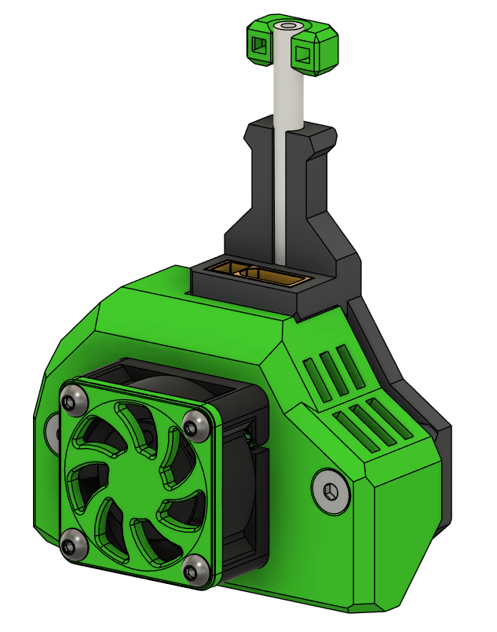

## LDO nitehawk36 Mount and fan cover

This is a universal board mount, meaning there it doesnt fit any extruder at the moment im going to be working on adding extruder specifc mounts soon 

## BOM
Item | Qty | Notes
--- | --- | ---
2510 Fan | 1
M2.5x16 | 4 | these were chosen as thats what XOL toolhead uses , figured users have those already , could use shorter and not need the printed fan spacer
M3x10 Male-Female standoffs | 2 | could be swapped for printed standoffs
M3x6 FHCS | 2 | swap to M3x20 FHCS if using a printed standoffs 
short length of PTFE | 1 | used for strain relief 

