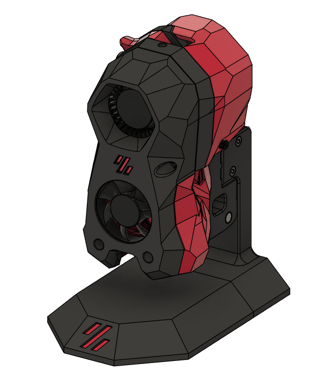
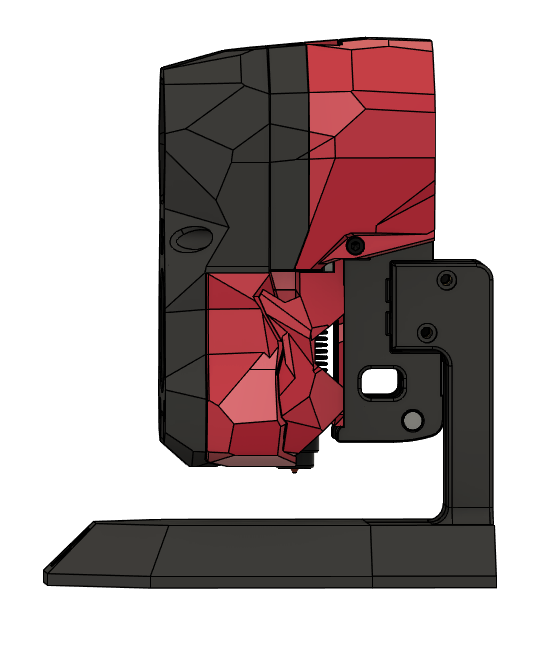
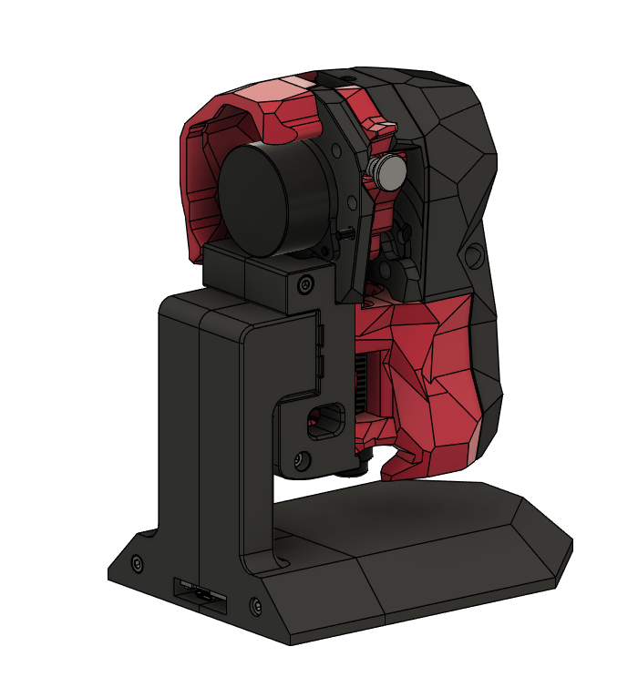

# Voron Toolhead Stand
 
 
 

This is a stand to hold a toolhead that mounts on an MGN12H carriage , made for Voron toolheads but would probably work with others (hasnt been tried yet)

there is a slot in the bottom to hold a WEMOS D1 Mini to run WLED to control the LEDs in the Stealthburner toolhead 

