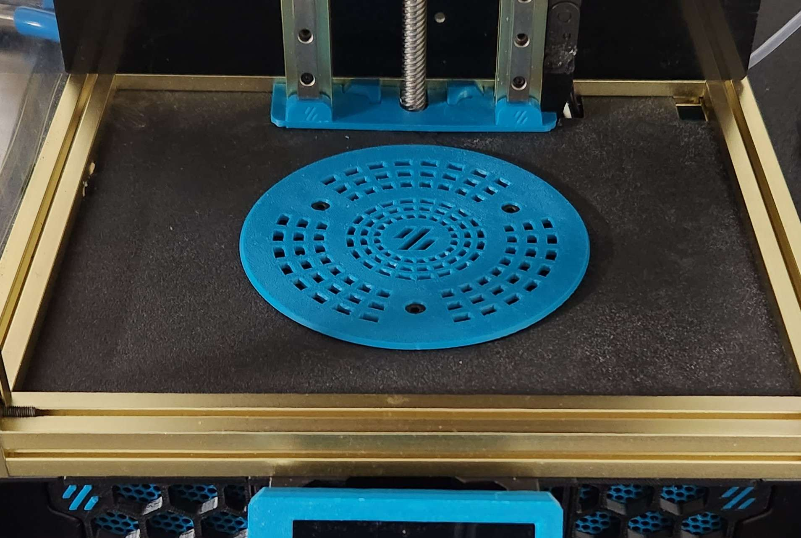
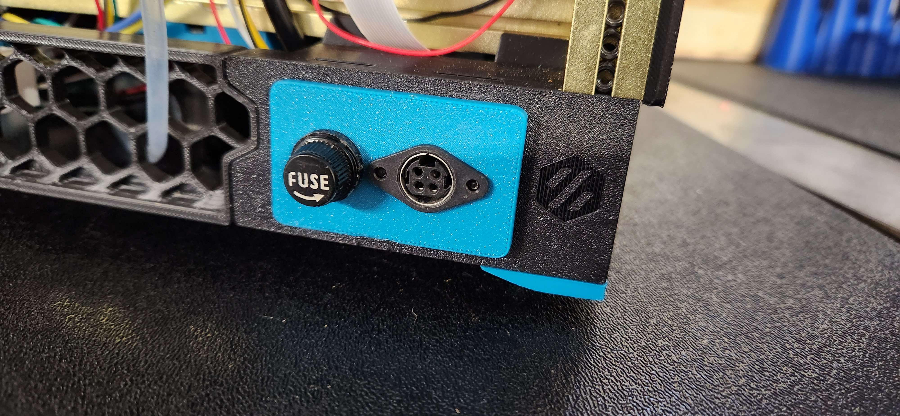
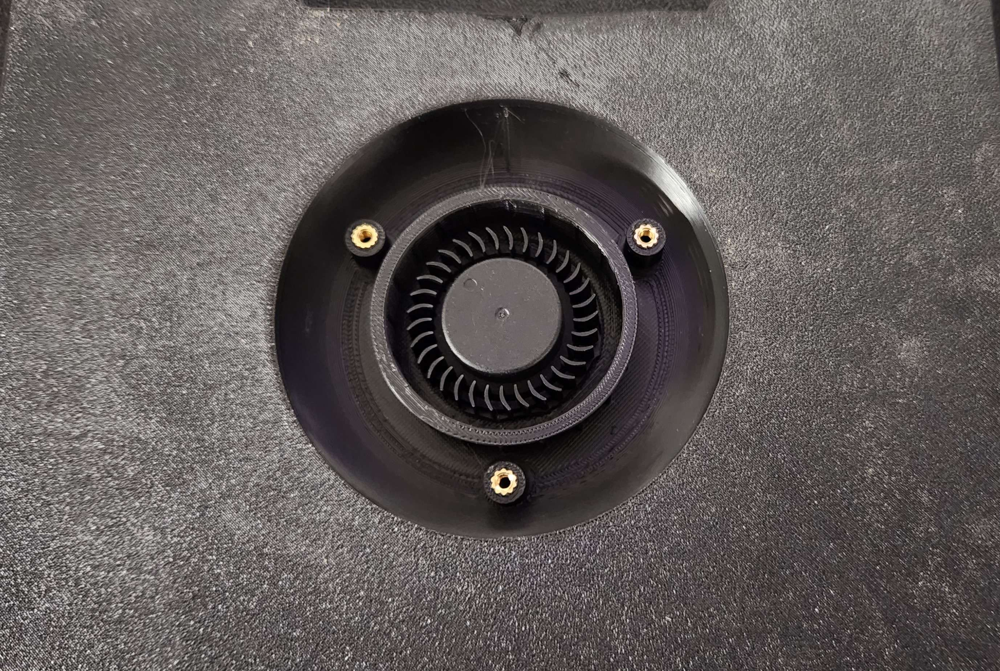

Shower Drain V0 Filter
============

Printed in deck carbon filter for the v0
 

you need to move the PSU to a different location, or use an external PSU. I went with the external [Meanwell GST220A24-R7B](https://www.amazon.com/gp/product/B01515NRL2/ref=ppx_yo_dt_b_search_asin_title?ie=UTF8&psc=1) there is a new inlet you can print [here](STLs/dc_inlet.stl) that fits in the stock inlet like so  and uses the [KJPX-PM-4S inlet](https://www.digikey.com/en/products/detail/kycon-inc/KPJX-PM-4S/9990081) that works with the meanwell PSU linked above

BOM
-----------------

In addition to things you can reuse from the stock build, these items are
required:
|Item|Qty|
|--|--|
|M3x8|6|
|Heatset|6
|5015 Fan | 1

Images
-----------------
 

