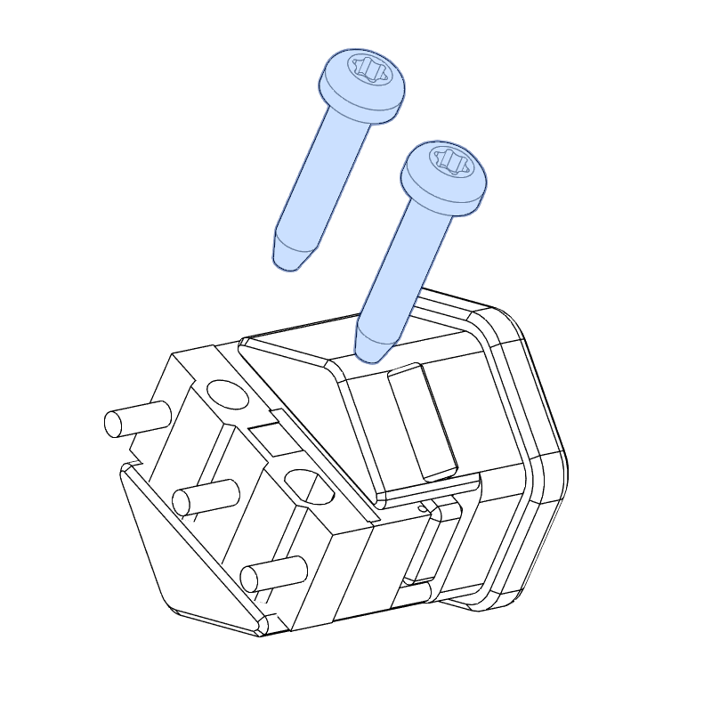

V0.2 Skirt Buttons 
============

I modified the skirt buttons from [Tircown](https://github.com/Tircown) in the Voron Usermods repo [here](https://github.com/VoronDesign/VoronUsers/tree/master/printer_mods/Tircown/V01_skirt_buttons) for the V0.1 skirts to fit the V0.2 skirts. I also made changes to use the standard D2F switches instead of the 6mm buttons

these are print in place buttons, once the print has completed press the button and make sure the pieces can move freely. 

* Insert the D2F switch (remove the lever if it has one)
* Secure with 2 m2x10 self tapping screws
* check he fitment but pressing the button to make sure its clicking the d2f switch and reseting properly 
* the button just presses / snaps into the skirt hexes 

 

Tip: if you are installing multiple switches in a row makes sure all the d2f switches are facing the same way, makes wiring a bit easier 

BOM
-----------------

This is BOM per buttons
|Item|Qty|
|--|--|
|M2x10 self tappers|2|
|D2F switch|1
