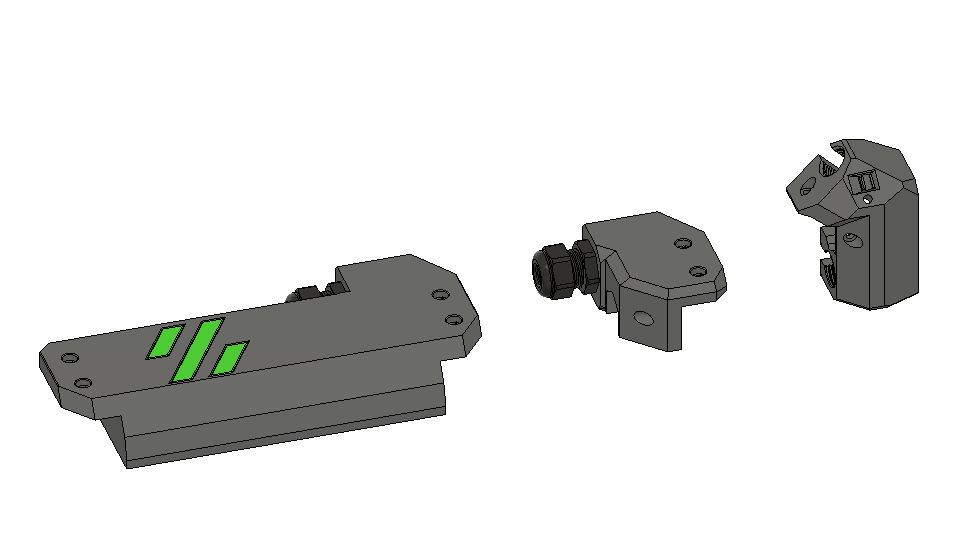

V2.4 Z Umbilical 
V2.4 Z chain replacement 

includes a A drive chamber thermistor mount as well as a toolhead umbilical mount

BOM 
|Part NO.  |Qty  |
|--|--|
M3x8 | 6 
M3 Tnuts | 6
PG7 Cable gland | 1
PG9 Cable gland | 2

