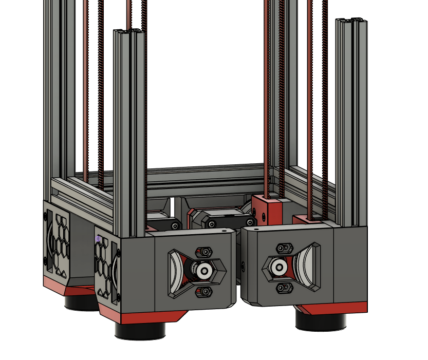

new Z drives modeled after Micron R1 Z drives 
picture is an older version, knly difference is the recessed hexagon size 

uses all same motion hardware as stock v2.4 z drives 

havent gotten fastener bom together yet but its all standard voron hardware 

stock skirts wont fit, but those are already being worked on and are coming soon

